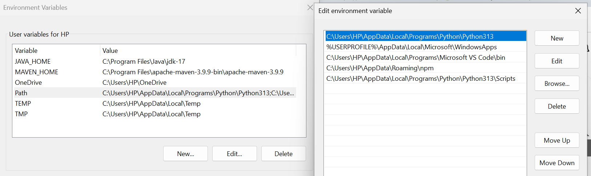
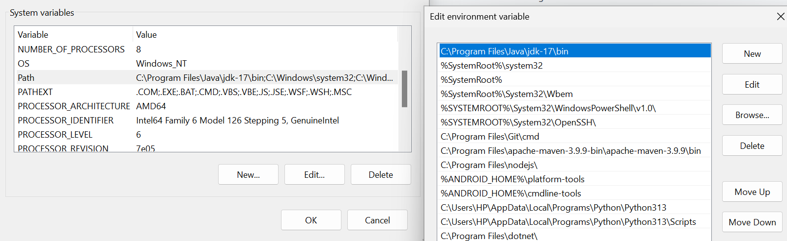

# robot framework

## Install Python 
1. Download python from https://www.python.org/downloads/
2. Download IDE Pycharm or Visual Studio Code.

## Edit Environment and System variables

System Variables

## Check Python Version
python --version

## install PIP
Along with python we get a package pip which helps us to install any other module or dependencies.

pip --version

## How to Start
1. Clone the project
2. Import the Project in PyCharm
3. Run `robot -d Results Tests/TestName.robot` to execute a single Test. Run `robot -d Results Tests` to execute all Tests.
4. Go to `Results` folder to get the HTML Reports.